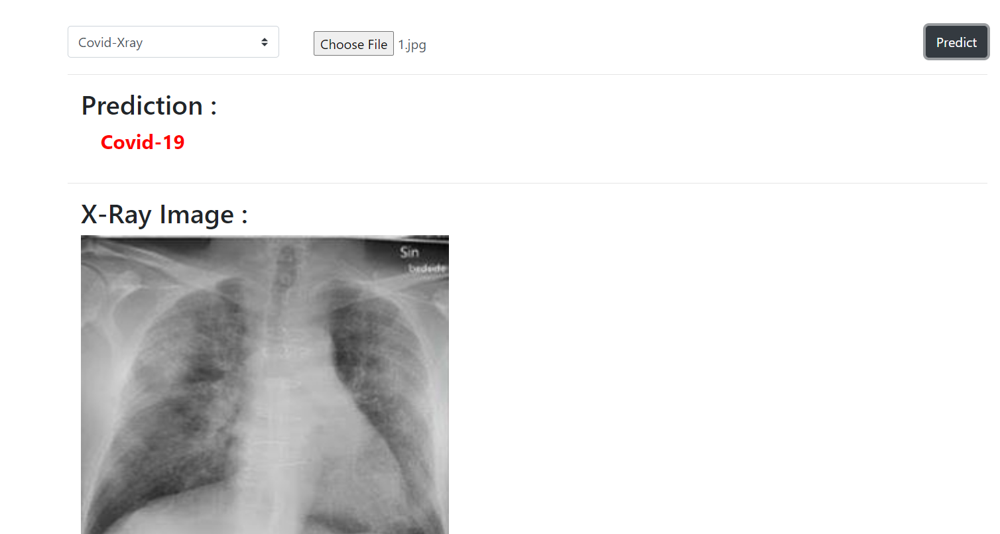

## Covid-jS 
web App used to classify covid-19 Patients from x-ray and ct-scans.

This App uses tensorflowjs to load the model and get predictions and nodejs as server .

I converted keras model with tensorflowjs-converter to use it on the browser.

# ScreenShot

	
	 
	<em>Covid-js web App</em>

# How to Run

Open comand line from Root directory:

1- npm install

2- npm start

3-open chrome on http://localhost:81/predict.html
